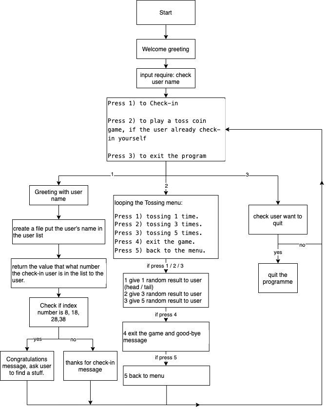
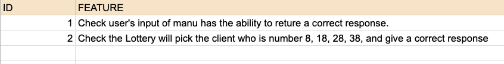
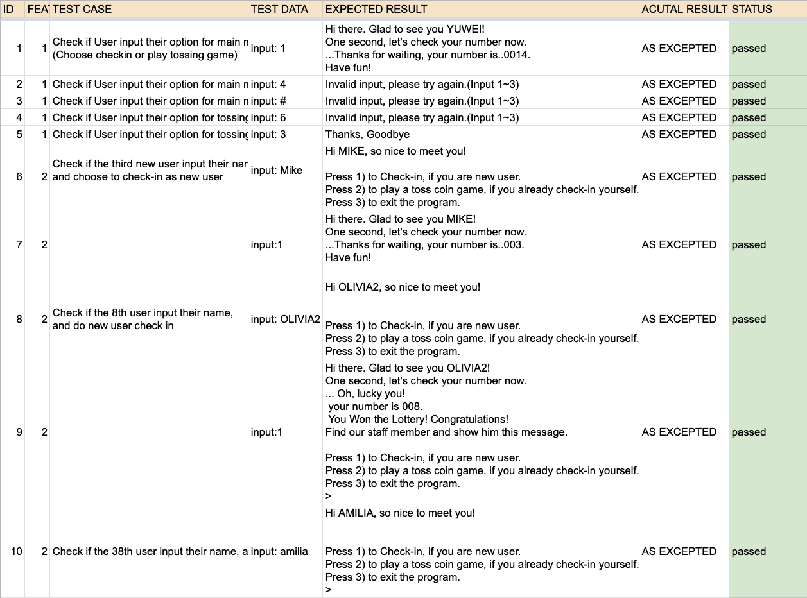
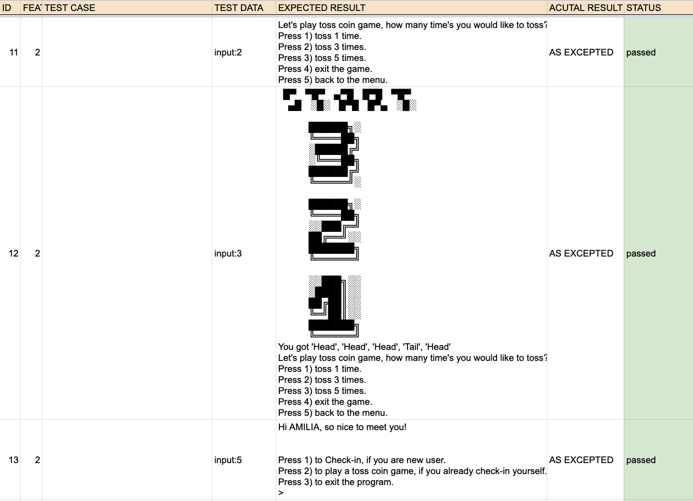
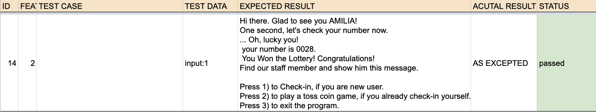
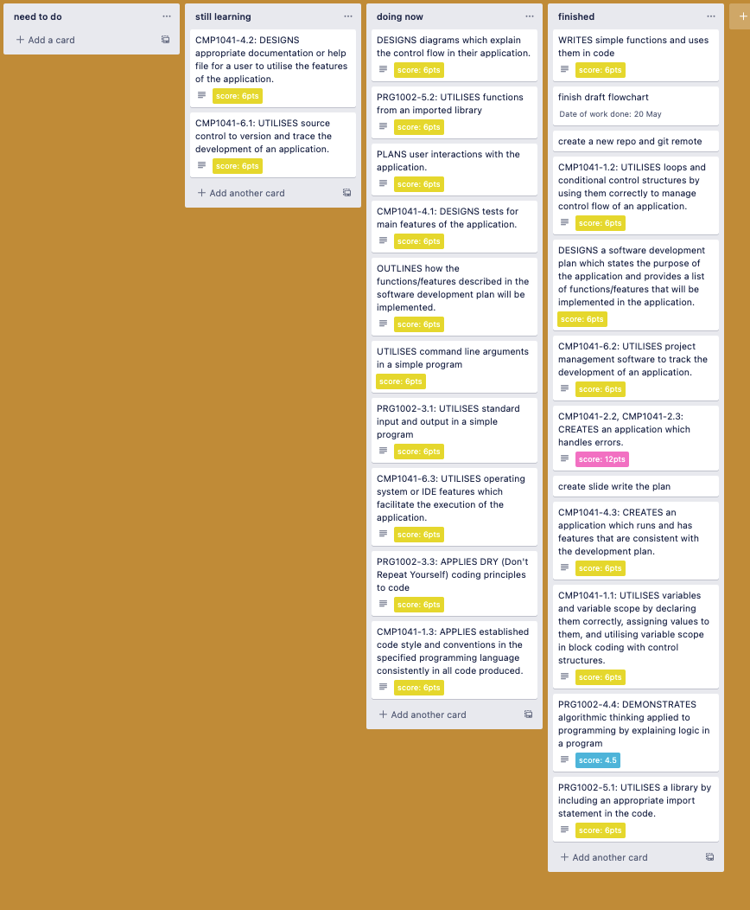

### Software Development Plan

### Small Marketing Event Check-in Application

---

#### Develop a statement of purpose and scope for your application

This app is design for provide to check-in service for organizer who need to running small size event and function. Most event will need one or two staff to work for check-in guests, the app will instead of paperwork and also automatic finish the lottery. Otherwise, the app also have the entertainment function that the user will get the lottery chance and choosing to play tossing coin game.

The user can input their namde and will get their client number, if the number is same as the lucky number the organizer set up for, the user will received congratulation message and get the present.

User also have option to play a tossing coin game, that they can choose play 1, 3 or 5 time. The result of game will display after they choose the menu.

The target audience is 5 ~ 35 people event.

---

#### Installation

---

##### The user who is require a guest check-in system

1. Download Ruby 2.7.1 or uper.
   [Click here](https://www.ruby-lang.org/en/news/2020/03/31/ruby-2-7-1-released/ "Ruby 2.7.1 released") to see the Ruby install menu.

2. Use [Ruby Bundler](https://bundler.io/ "Bundler") install the[ Ruby colorize gem](https://rubygems.org/ "Ruby 2.7.1 released").

##### How to run the application

1. Use command line, into the directory named " src/ ". Please make sure your laptop or PC had install the VS.CODE ( [Visual Studio Code](https://code.visualstudio.com/ "Bundler") ) or kind of other software.

```
cd src
code .
```

##### For lottery number setting

1. Please save all the clients data in client_data file and clear all data in this file.

```
/src/client_data.txt
```

2. Change the code on the method.rb in line 89.

```
/src/method.rb

if line_count == 8 || line_count == 18 ||  line_count == 28 ||  line_count == 38
```

Please change the number for which index number you want the client get the lottery.

---

#### Features

---

Feature 1

> The Check-in application have a smooth greeting function that can ask guests to input their name and response the check-in index number for guests.

Feature 2

> The Menu system was design for guests to check-in and also check their index number if is was same with the organizor setting number, they will get a winner message and this function will help event organizor to increase the attractive for customer.

Feature 3

> The application also have simple function that can provide entertainment for guests, tossing coin game is fun also have wide different theme possibility but it is "not too much game" for event that help people social with others.

---

#### Diagram

---



---

#### Manual testing

---

[Click here](https://docs.google.com/spreadsheets/d/1CLAdqfYu0Y8tO7SLcoBg99b9pW2JXJJpPiqGjf-vNW4/edit?usp=sharing "Manual testing") to see the original sheet of manual testing.

1. 
2. 
3. 
4. 

---

#### Working control flow

---

Use trello to control working tasks and management the project.

